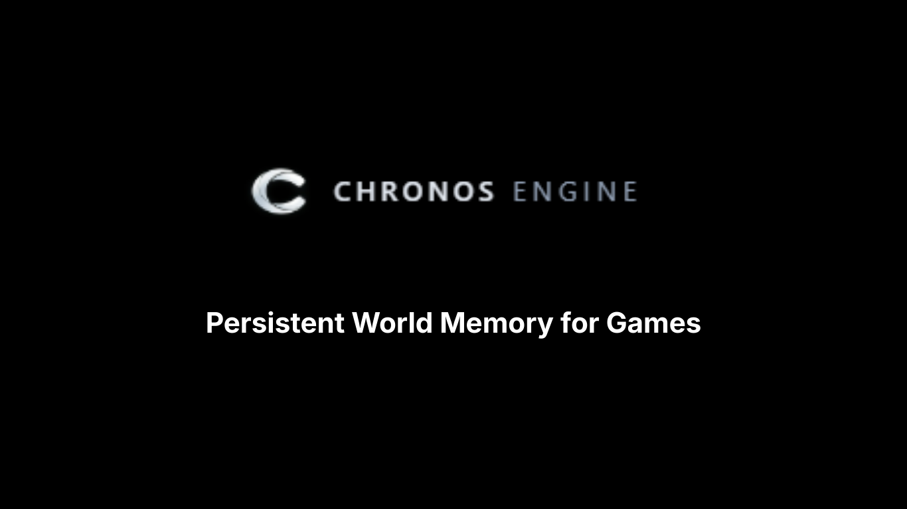

# Chronos Godot SDK

Official Godot SDK for Chronos Engine.

Chronos gives your game **persistent world memory, evolving NPC state, and AI-driven behavior**.

Instead of NPCs forgetting everything between sessions, Chronos lets them **remember player actions and react over time**.

---

## Supported Versions

- Godot 3.6
- Godot 4.5

---

## Getting Started

Integrating Chronos into your game takes just a few steps.

---

### 1. Install the SDK

Copy the SDK into your project:
res://addons/chronos/


Required files:

- Chronos.gd  
- ChronosRESTClient.gd  
- ChronosSSEClient.gd  
- ChronosTypes.gd  
- plugin.gd  
- plugin.cfg  

---

### 2. Enable the Plugin

In Godot:

- Open **Project → Project Settings → Plugins**  
- Find **Chronos**  
- Set to **Enabled**

---

### 3. Configure Chronos

Initialize Chronos with your project credentials:

```gdscript
Chronos.configure(
  "https://YOUR-VERCEL-URL",
  "CHRONOS_API_KEY",
  "your_world_id",
  "npc_id"
)

Chronos.configure_runtime(true, 2, 50)
Chronos.start()
How It Works

Your game no longer manages NPC logic manually.

Instead:

Your Game → sends events  
Chronos → stores memory  
Chronos Brain → derives NPC state  
Your Game → reacts automatically  
Core Integration

There are only two things your game needs to do:

1. Listen for NPC updates

When Chronos updates an NPC’s state, your game reacts:

Chronos.npc_state_updated.connect(_on_npc_state_updated)

func _on_npc_state_updated(row):
  var npc_id = row["npc_id"]
  var state = row["state"]
  print("NPC state updated:", npc_id, state)
2. Send gameplay events

Whenever something important happens in your game:

Chronos.append_event(
  "player_1",
  "player_lied_to_guard",
  {"context":"conversation"},
  true
)
What Chronos Handles Automatically

You don’t need to manage:

storing events

running AI logic

updating NPC state

syncing state back to the game

Chronos handles all of this for you.

Optional: Load NPC State on Startup

To instantly restore memory:

Chronos.get_npc_state("guard_1")

This ensures NPCs reflect past actions immediately when the game starts.

Example Project

Full demo:

https://github.com/enginechronos/chronos-demo

Docs

https://chronos-magic-engine-live.vercel.app/docs

License

MIT License